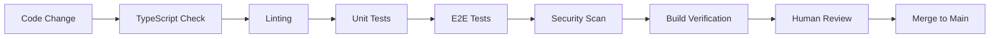

# Architecture Overview

## Table of Contents
- [Stack Overview](#stack-overview)
- [Repository Structure](#repository-structure)
- [UI Framework Rules](#ui-framework-rules)
- [Development Architecture](#development-architecture)
- [Security Architecture](#security-architecture)
- [Quality Architecture](#quality-architecture)

## Stack Overview

### Core Technologies
- **Frontend**: Next.js 15 with App Router, React 19, TypeScript
- **Backend**: Supabase (PostgreSQL, Auth, Real-time)
- **Build System**: Turborepo monorepo with workspace management
- **Styling**: Tailwind CSS with design tokens
- **UI Components**: shadcn/ui component library
- **Deployment**: Vercel with automatic preview deployments
- **Monitoring**: Sentry for error tracking and performance

### Development Tools
- **Package Manager**: pnpm with workspace support
- **Testing**: Vitest (unit), Playwright (E2E)
- **Linting**: ESLint with TypeScript rules
- **Type Checking**: Strict TypeScript configuration
- **CI/CD**: GitHub Actions with quality gates

## Repository Structure

```
├── apps/
│   └── web/                 # Next.js application
│       ├── src/
│       │   ├── app/         # App Router pages and layouts
│       │   ├── components/  # React components
│       │   └── lib/         # Utilities and configurations
│       └── tests/           # E2E tests (Playwright)
│
├── packages/
│   ├── types/               # Shared TypeScript types
│   ├── ui/                  # Shared UI components
│   └── config/              # Shared configurations
│
├── docs/                    # Project documentation
│   ├── constitution.md      # Governance and principles
│   ├── commands/            # Slash command definitions
│   └── recipes/             # Implementation guides
│
├── .claude/commands/        # AI workflow commands
├── specs/                   # Feature specifications
├── plans/                   # Implementation plans
├── tasks/                   # Development task breakdowns
└── wiki/                    # GitHub wiki content
```

### Workspace Organization
- **apps/**: Deployable applications
- **packages/**: Shared libraries and utilities
- **Turborepo**: Manages dependencies and build orchestration
- **TypeScript**: Strict typing across all workspaces

## UI Framework Rules

### Component Hierarchy
1. **shadcn/ui Components** (Primary)
   - Use for all standard UI patterns
   - Maintains design system consistency
   - Built-in accessibility features

2. **Custom Components** (Secondary)
   - Domain-specific business logic
   - Composed from shadcn/ui primitives
   - Project-specific patterns

3. **Third-party Components** (Rare)
   - Only when shadcn/ui insufficient
   - Must justify dependency addition
   - Security and bundle size review required

### Styling Rules
- **Tailwind CSS Only**: No custom CSS files
- **Design Tokens**: Use CSS custom properties for theming
- **No Hardcoded Colors**: Use semantic color tokens
- **Responsive Design**: Mobile-first approach
- **Dark Mode**: Support via CSS custom properties

### Example Component Structure
```tsx
// ✅ Good: Uses shadcn/ui + custom logic
import { Button } from '@ui/components';
import { useAnalytics } from '@/lib/analytics';

export function AnalyticsButton() {
  const { trackClick } = useAnalytics();
  
  return (
    <Button 
      onClick={() => trackClick('analytics-view')}
      className="bg-[hsl(var(--primary))]"
    >
      View Analytics
    </Button>
  );
}

// ❌ Bad: Hardcoded styles, no design system
export function CustomButton() {
  return (
    <button className="bg-blue-500 text-white px-4 py-2">
      Click Me
    </button>
  );
}
```

## Development Architecture

### Dual-Lane System
**Simple Lane**: Direct implementation for small changes  
**Spec-Driven Lane**: Structured planning for complex features

### AI Integration Points
- **Branch Isolation**: AI work confined to `bots/claude/*` branches
- **Quality Gates**: Same standards for AI and human contributions
- **Review Process**: AI advisory, human authoritative
- **Promotion System**: Manual `promote` label required for AI PRs

### Workflow Orchestration
- **Slash Commands**: Structured multi-step workflows
- **NPM Scripts**: Individual operations and git helpers
- **GitHub Actions**: Automated quality and security checks

## Security Architecture

### Defense in Depth
1. **Input Validation**: All user inputs validated and sanitized
2. **Environment Isolation**: Strict separation of environments
3. **Secrets Management**: No secrets in code or version control
4. **Dependency Security**: Regular vulnerability scanning
5. **Access Control**: Principle of least privilege

### AI Security Boundaries
- **Path Restrictions**: AI cannot modify workflows or environment files
- **Branch Isolation**: AI work isolated from main development
- **Review Requirements**: Human oversight for all AI contributions
- **Audit Trail**: All AI interactions logged and traceable

### Authentication & Authorization
```typescript
// Authentication flow with Supabase
const { data: user, error } = await supabase.auth.getUser();

// Route protection middleware
export function withAuth(handler: NextApiHandler) {
  return async (req: NextApiRequest, res: NextApiResponse) => {
    const token = req.headers.authorization?.replace('Bearer ', '');
    if (!token) return res.status(401).json({ error: 'Unauthorized' });
    
    // Validate token and proceed
    return handler(req, res);
  };
}
```

## Quality Architecture

### Testing Strategy
- **Unit Tests**: Component and utility function testing
- **Integration Tests**: API and database interaction testing
- **E2E Tests**: Complete user journey validation
- **Visual Testing**: Component appearance and responsive behavior

### Quality Gates Pipeline


### Monitoring & Observability
- **Error Tracking**: Sentry for runtime error monitoring
- **Performance**: Core Web Vitals and custom metrics
- **Analytics**: User behavior tracking (feature-flagged)
- **Logs**: Structured logging for debugging

---
*Architecture balances rapid development velocity with security, quality, and maintainability*